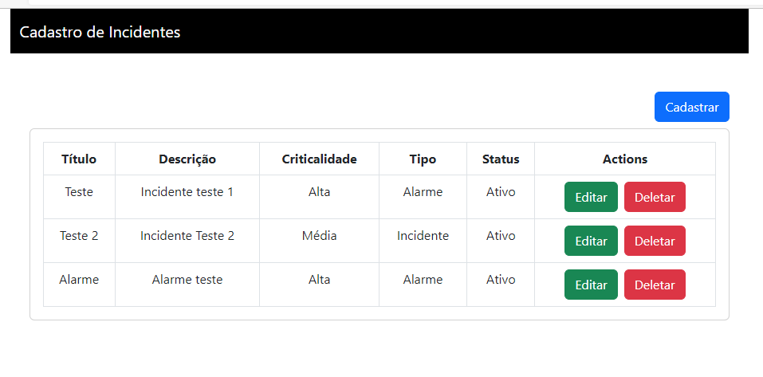
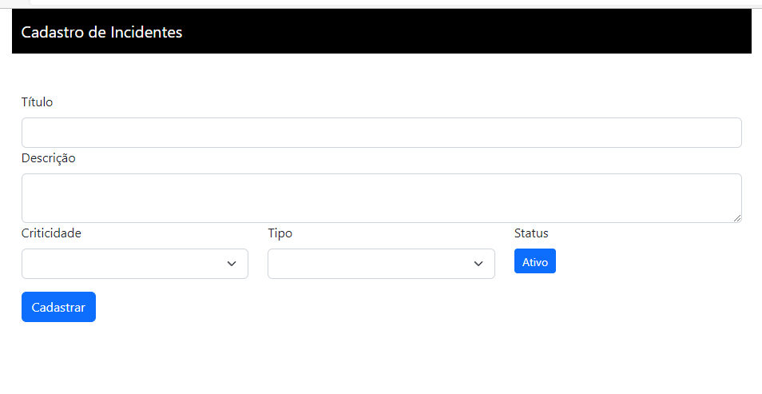
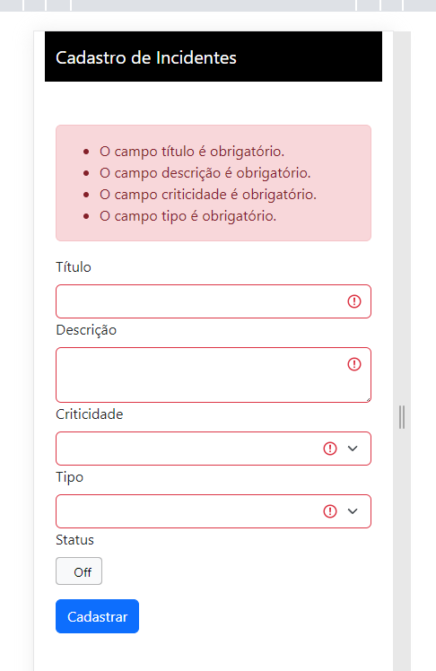
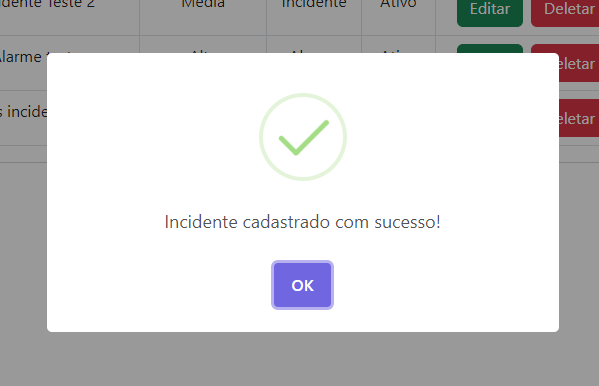
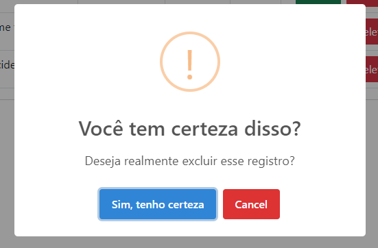

<h1 align="center">
    Cadastro de Incidentes Web (Front-end)
</h1>

## 🛥️ Sobre o projeto
Esse sistema trata-se de um da versão web para o gerenciamento de incidentes. Ele se comunica com outro sistema backend e realiza as operações básicas para cadastro, listagem, edição e exclusão de "incidents". 

## 🏗️ Tecnologias:
- **[React](https://pt-br.reactjs.org/)**
- **[Vite](https://vitejs.dev/)**
- **[React Bootstrap](https://react-bootstrap.github.io/)**
- **[sweetalert2](https://sweetalert2.github.io/)**

## 🚀 Como rodar esse projeto
Primeiramente, clone este repositório aonde você costuma desenvolver seus projetos:
```
git clone git@github.com:lucassouzati/crud-incidentes-web.git
```
Certifique-se que esteja com seu ambiente de desenvolvimento Node configurado com gerenciador de pacote npm (ou outro de preferência), e execute o comando:
```
npm install && npm run dev
```
Acesse o site pelo localhost na porta 5173, ou a porta que for escolhida para executar a aplicação
```
http://localhost:5173/
```
A aplicação reconhece a URL "http://localhost/api" como base de todos endpoints da API. Mas caso seja necessário trabalhar com outra URL, basta apenas alterar a URL base no arquivo ./src/services/api.jsx:
```jsx
import axios from 'axios'

export default function setupApiClient(){
    const api = axios.create({
        baseURL: 'http://localhost/api',
      })

      return api
}
```
## 🪟 Layout
Os registros estão sendo listados numa tabela, com um botão para Editar e Excluir. 
<h4 align="center">
    
</h4>

Através do botão "Cadastrar", é mostrado um formulário para preenchimento de novas informações. 
<h4 align="center">
    
</h4>

A validação foi implementada tanto na API como nas propriedades de validação dos componentes. Com o auxílio das classes de estilização do Bootstrap, os campos inválidos são destacados. Além disso, ele abstrai a responsividade através das grids.
<h4 align="center">
    
</h4>

Foi utilizado a biblioteca sweetalert2 para emitir alertas estilizados para o usuário.
<h4 align="center">
    
    
</h4>

## 🤔 Como contribuir para o projeto

- Faça um **fork** do projeto;
- Crie uma nova branch com as suas alterações: `git checkout -b my-feature`
- Salve as alterações e crie uma mensagem de commit contando o que você fez:`git commit -m "feature: My new feature"`
- Envie as suas alterações: `git push origin my-feature`

> Caso tenha alguma dúvida confira este [guia de como contribuir no GitHub](https://github.com/firstcontributions/first-contributions)

## 📝 Licença

Este projeto esta sobe a licença MIT. Veja a [LICENÇA](https://opensource.org/licenses/MIT) para saber mais.

Feito com ❤️ por Lucas Siqueira 👋🏽 [Entre em contato!](https://www.linkedin.com/in/lucas-de-souza-siqueira-a6469952/)
